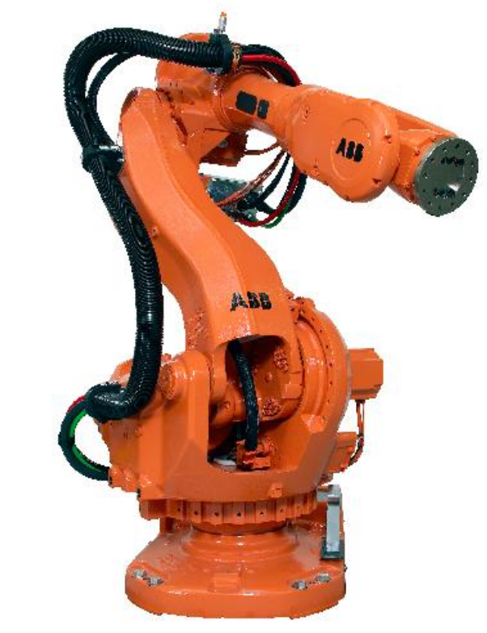

&emsp;
# History
## 1 Definition of Robot

The term `robot` was first introduced into our vocabulary by the Czech playwright `Karel Capek` in his 1920 play Rossum’s Universal Robots, the word robota being the Czech word for work. 

Since then the term has been applied to a great variety of mechanical devices, such as:
- teleoperators
- underwater vehicles
- autonomous land rovers, etc

Virtually anything that operates with some degree of autonomy, usually under computer control, has at some point been called a robot. 

&emsp;
## 2 Robot in this text
In this text the term robot will mean a computer controlled industrial manipulator of the type shown in the following figure:

    
    <h4> The ABB IRB6600 Robot<h>

This type of robot is essentially a mechanical arm operating under computer control. Such devices, though far from the robots of science fiction, are nevertheless extremely complex electro-mechanical systems whose analytical description requires advanced methods, and which present many challenging and interesting research problems.

An official definition of such a robot comes from the Robot Institute of America (RIA):
- A robot is a reprogrammable multifunctional manipulator designed to move material, parts, tools, or specialized devices through variable programmed motions for the performance of a variety of tasks.

The key element in the above definition is the reprogrammability of robots. It is the computer brain that gives the robot its utility and adaptability. The so-called robotics revolution is, in fact, part of the larger computer revolution.

Even this restricted version of a robot has several features that make it attractive in an industrial environment. Among the advantages often cited in favor of the introduction of robots are decreased labor costs, increased precision and productivity, increased flexibility compared with specialized machines, and more humane working conditions as dull, repetitive, or hazardous jobs are performed by robots.

The robot, as we have defined it, was born out of the marriage of two earlier technologies:
- teleoperators and numerically controlled milling machines. 

>Teleoperators
- Teleoperators, or master-slave devices, were developed during the second world war to handle radioactive materials

>Computer numerical control (CNC)
- Computer numerical control (CNC) was developed because of the high precision required in the machining of certain items, such as components of high performance aircraft.

The first robots essentially combined the mechanical linkages of the teleoperator with the autonomy and programmability of CNC machines. 

&emsp;
## 3 Milestones in the History of Robotics
Several milestones on the road to present day robot technology are listed below.

- 1947 — the first servoed electric powered teleoperator is developed
- 1948 — a teleoperator is developed incorporating force feedback
- 1949 — research on numerically controlled milling machine is initiated
- 1954 — George Devol designs the first programmable robot
- 1956 — Joseph Engelberger, a Columbia University physics student, buys the rights to Devol’s robot and founds the Unimation Company
- 1961 — the first Unimate robot is installed in a Trenton, New Jersey plant of General
Motors to tend a die casting machine
- 1961 — the first robot incorporating force feedback is developed
- 1963 — the first robot vision system is developed
- 1971 — the Stanford Arm is developed at Stanford University
- 1973 — the first robot programming language (WAVE) is developed at Stanford
- 1974 — Cincinnati Milacron introduced the T3
robot with computer control
- 1975 — Unimation Inc. registers its first financial profit
- 1976 — the Remote Center Compliance (RCC) device for part insertion in assembly is developed at Draper Labs in Boston
- 1976 — Robot arms are used on the Viking I and II space probes and land on Mars
- 1978 — Unimation introduces the PUMA robot, based on designs from a General Motors study
- 1979 — the SCARA robot design is introduced in Japan
- 1981 — the first direct-drive robot is developed at Carnegie-Mellon University
- 1982 — Fanuc of Japan and General Motors form GM Fanuc to market robots in North America
- 1983 — Adept Technology is founded and successfully markets the direct drive robot
- 1986 — the underwater robot, Jason, of the Woods Hole Oceanographic Institute, explores the wreck of the Titanic, found a year earlier by Dr. Robert Barnard.
- 1988 — St¨aubli Group purchases Unimation from Westinghouse
- 1988 — the IEEE Robotics and Automation Society is formed
- 1993 — the experimental robot, ROTEX, of the German Aerospace Agency (DLR) was flown aboard the space shuttle Columbia and performed a variety of tasks under both teleoperated and sensor-based offline programmed modes
- 1996 — Honda unveils its Humanoid robot; a project begun in secret in 1986
- 1997 — the first robot soccer competition, RoboCup-97, is held in Nagoya, Japan and draws 40 teams from around the world
- 1997 — the Sojourner mobile robot travels to Mars aboard NASA’s Mars PathFinder mission
- 2001 — Sony begins to mass produce the first household robot, a robot dog named Aibo
- 2001 — the Space Station Remote Manipulation System (SSRMS) is launched in space on board the space shuttle Endeavor to facilitate continued construction of the space station
- 2001 — the first telesurgery is performed when surgeons in New York performed a laparoscopic gall bladder removal on a woman in Strasbourg, France
- 2001 — robots are used to search for victims at the World Trade Center site after the September 11th tragedy
- 2002 — Honda’s Humanoid Robot ASIMO rings the opening bell at the New York Stock Exchange on February 15th

The first successful applications of robot manipulators generally involved some sort of material transfer, such as injection molding or stamping where the robot merely attended a press to unload and either transfer or stack the finished part. 

These first robots were capable of being programmed to execute a sequence of movements, such as:
- moving to a location A
- closing a gripper
- moving to a location B, etc.

but had no external sensor capability.

More complex applications, such as welding, grinding, deburring, and assembly require not only more complex motion but also some form of external sensing such as `vision`, `tactile`, or `force-sensing`, due to the increased interaction of the robot with its environment.

It should be pointed out that the important applications of robots are by no means limited to those industrial jobs where the robot is directly replacing a human worker. There
are many other applications of robotics in areas where the use of humans is impractical or undesirable. Among these are:
- undersea and planetary exploration
- satellite retrieval and repair
- the defusing of explosive devices
- work in radioactive environments. 

Finally, prostheses, such as artificial limbs, are themselves robotic devices requiring methods of analysis and design similar to those of industrial manipulators.