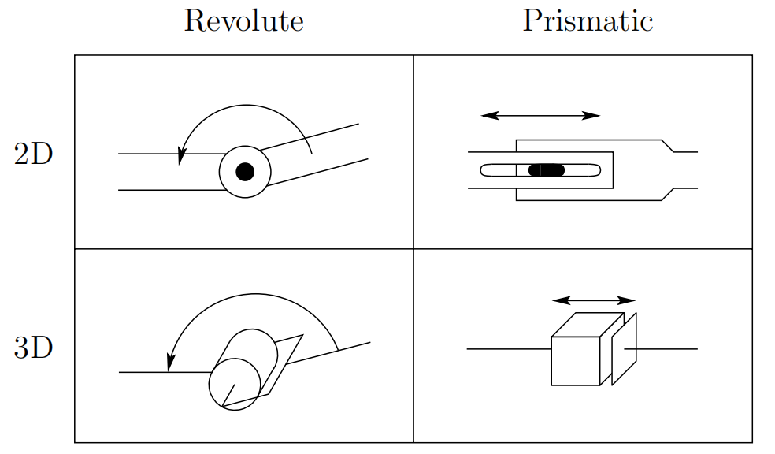

&emsp;
# Symbolic Representation of Robots

Robot Manipulators are composed of links connected by joints into a kinematic chain.
Joints are typically `rotary (revolute)` or `linear (prismatic)`:
- `Rotary (Revolute)`: A revolute joint is like a hinge and allows relative rotation between two links
- `Linear (Prismatic)`: A prismatic joint allows a linear relative motion between two links.

We use the convention ($R$) for representing revolute joints and ($P$) for prismatic joints and draw them as shown in Figure 1.2

    
    <h4>Figure 1.2: Symbolic representation of robot joints<h>

&emsp;

Each joint represents the interconnection between two links, say $l_i$ and $l_{i+1}$. 

We denote the axis of rotation of a revolute joint, or the axis along which a prismatic joint slides by $z_i$
if the joint is the interconnection of links $l_i$ and $l_{i + 1}$. 

The joint variables, denoted by $θ_i$ for a revolute joint and $d_i$ for the prismatic joint, represent the relative displacement between adjacent links. We will make this precise in Chapter 3.