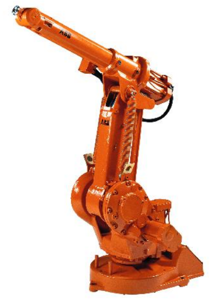
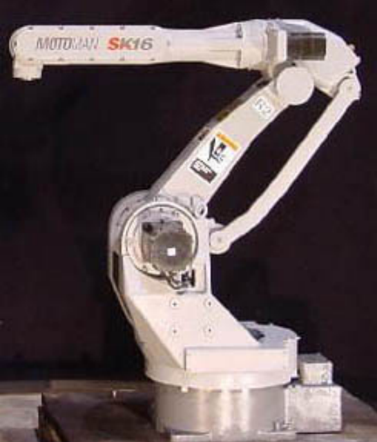
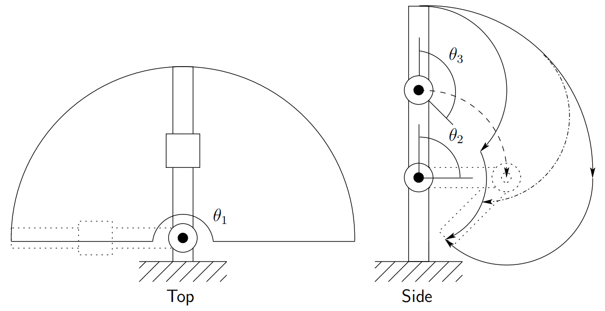

&emsp;
## Common Kinematic Arrangements

# Articulated Configuration (RRR)
The articulated manipulator is also called a revolute, or anthropomorphic manipulator.

The ABB IRB1400 articulated arm is shown in Figure 1.3. 

    
    <h4>Figure 1.3: The ABB IRB1400 Robot<h>

&emsp;

A common revolute joint design is the parallelogram linkage such as the Motoman SK16, shown in Figure 1.4. 

    
    <h4>Figure 1.4: The Motoman SK16 manipulator<h>

&emsp;

In both of these arrangements joint axis $z_2$ is parallel to $z_1$ and both $z_1$ and $z_2$ are perpendicular to $z_0$. The structure and terminology associated with the elbow manipulator are shown in Figure 1.5. 

    
    <h4>Figure 1.5: Structure of the elbow manipulator<h>

&emsp;

Its workspace is shown in Figure 1.6. 

    
    <h4>Figure 1.6: Workspace of the elbow manipulator<h>

&emsp;

The `revolute configuration` provides for relatively large freedom of movement in a compact space. The parallelogram linkage, although less dextrous typically than the `elbow manipulator configuration`, nevertheless has several advantages that make it an attractive and popular design. 

The most notable feature of the parallelogram linkage configuration is that the actuator for joint 3 is located on link 1. Since the weight of the motor is born by link 1, links 2 and 3 can be made more lightweight and the motors themselves can be less powerful. Also the dynamics of the parallelogram manipulator are simpler than those of the elbow manipulator, thus making it easier to control.

