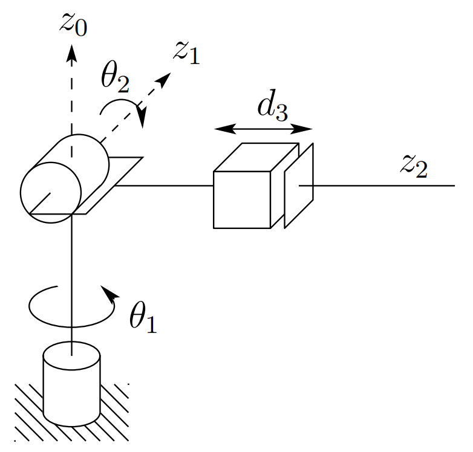
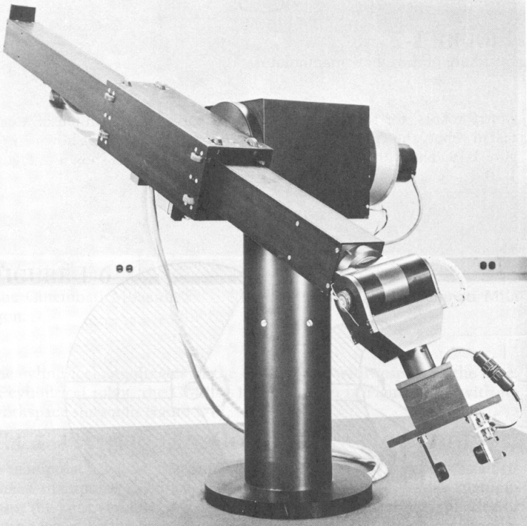
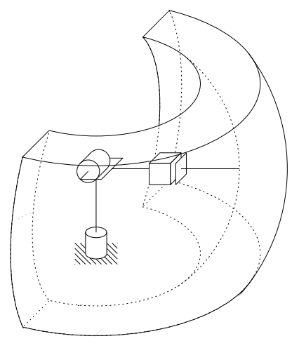

&emsp;
# Spherical Configuration (RRP)
By replacing the third or elbow joint in the revolute configuration by a prismatic joint one obtains the spherical configuration shown in Figure 1.7. 

    
    <h4>Figure 1.7: The spherical manipulator configuration<h>

&emsp;

The term spherical configuration derives from the fact that the spherical coordinates defining the position of the end-effector with respect to a frame whose origin lies at the intersection of the axes $z_1$ and $z_2$ are the same as the first three joint variables. 

    
    <h4>Figure 1.8: The Stanford Arm<h>

&emsp;

Figure 1.8 shows the Stanford Arm, one of the most well-known spherical robots. The workspace of a spherical manipulator is shown in Figure 1.9

    
    <h4>Figure 1.9: Workspace of the spherical manipulator<h>

