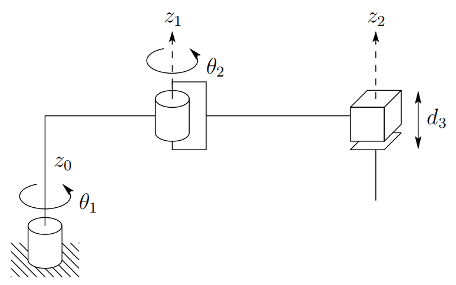
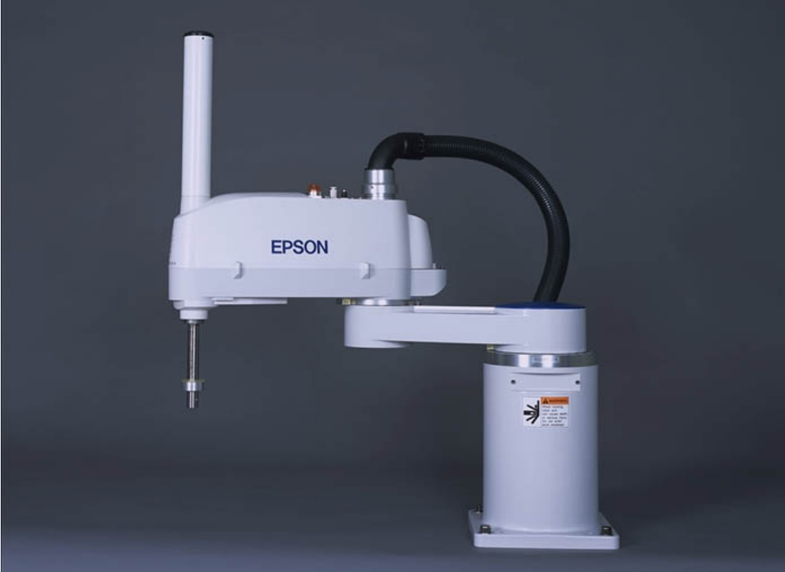
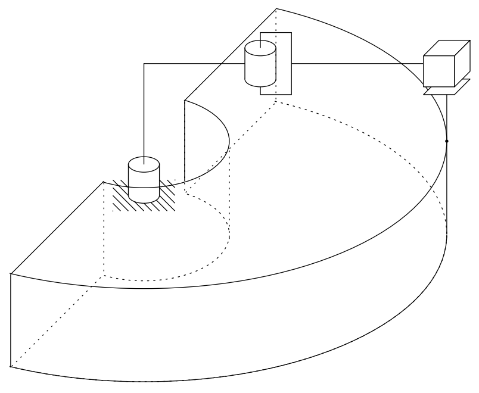

&emsp;
# SCARA Configuration (RRP)
The so-called SCARA (for Selective Compliant Articulated Robot for Assembly) shown in Figure 1.10 is a popular configuration, which, as its name suggests, is tailored for assembly operations. 

    
    <h4>Figure 1.10: The SCARA<h>

&emsp;

Although the SCARA has an RRP structure, it is quite different from the spherical configuration in both appearance and in its range of applications. Unlike the spherical design, which has $z_0$, $z_1$, $z_2$ mutually perpendicular, the SCARA has $z_0$, $z_1$, $z_2$ parallel. 

    
    <h4>Figure 1.11: The Epson E2L653S SCARA Robot<h>

&emsp;

Figure 1.11 shows the Epson E2L653S, a manipulator of this type. The SCARA manipulator workspace is shown in Figure 1.12.

    
    <h4>Figure 1.12: Workspace of the SCARA manipulator<h>

