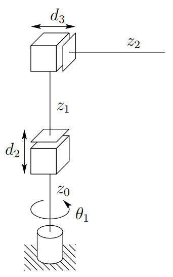

&emsp;
# Cylindrical Configuration (RPP)

The cylindrical configuration is shown in Figure 1.13. 

    
    <h4>Figure 1.13: The cylindrical manipulator configuration<h>

&emsp;

The first joint is revolute and produces a rotation about the base, while the second and third joints are prismatic. As the name
