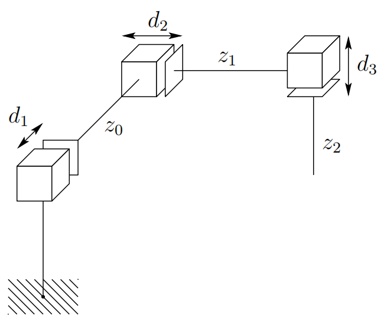
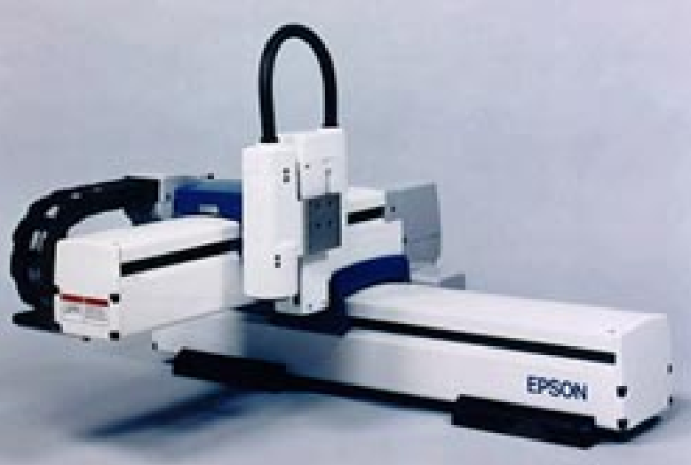
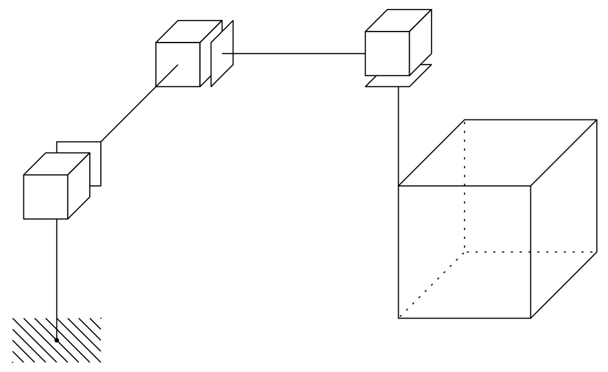

&emsp;
# Cartesian configuration (PPP)

A manipulator whose first three joints are prismatic is known as a cartesian manipulator, shown in Figure 1.16.

    
    <h4>Figure 1.16: The cartesian manipulator configuration<h>

&emsp;

For the Cartesian manipulator the joint variables are the Cartesian coordinates of the end-effector with respect to the base. As might be expected the kinematic description of this manipulator is the simplest of all configurations. Cartesian configurations are useful for table-top assembly applications and, as gantry robots, for transfer of material or cargo.

An example of a cartesian robot, from Epson-Seiko, is shown in Figure 1.17. 

    
    <h4>Figure 1.17: The Epson Cartesian Robot<h>

&emsp;

The workspace of a Cartesian manipulator is shown in Figure 1.18.

    
    <h4>Figure 1.18: Workspace of the cartesian manipulator<h>

