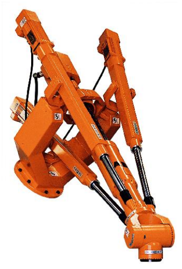

&emsp;
# Parallel Manipulator

A parallel manipulator is one in which the links form a closed chain. More specifically, a parallel manipulator has two or more independent kinematic chains connecting the base to the end-effector. 

    
    <h4>Figure 1.19: The ABB IRB940 Tricept Parallel Robot<h>

&emsp;

Figure 1.19 shows the ABB IRB 940 Tricept robot, which has a parallel configuration. The closed chain kinematics of parallel robots can result in greater structural rigidity, and hence greater accuracy, than open chain robots. 

The kinematic description of parallel robots fundamentally different from that of serial link robots and therefore requires different methods of analysis.