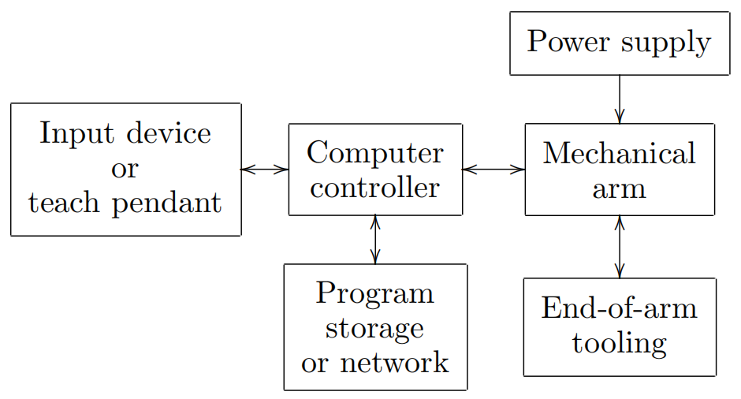

&emsp;
# Robotic Systems

A robot manipulator should be viewed as more than just a series of mechanical linkages. The mechanical arm is just one component to an overall Robotic System, shown in Figure 1.20, which consists of the arm, external power source, end-of-arm tooling, external and internal sensors, computer interface, and control computer. 

    
    <h4>Figure 1.20: Components of a robotic system<h>

&emsp;

Even the programmed software should be considered as an integral part of the overall system, since the manner in which the robot is programmed and controlled can have a major impact on its performance and subsequent range of applications.

