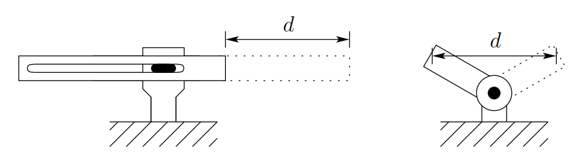

&emsp;
# Accuracy and Repeatability

>Accuracy
- The accuracy of a manipulator is a measure of how close the manipulator can come to a given point within its workspace. 

>Repeatability
- Repeatability is a measure of how close a manipulator can return to a previously taught point. Most present day manipulators are highly repeatable but not very accurate. 

The primary method of sensing positioning errors in most cases is with position encoders located at the joints, either on the shaft of the motor that actuates the joint or on the joint itself. There is typically no direct measurement of the end-effector position and orientation. One must rely on the assumed geometry of the manipulator and its rigidity to infer (i.e., to calculate) the end-effector position from the measured joint angles. 

Accuracy is affected therefore by computational errors, machining accuracy in the construction of the manipulator, flexibility effects such as the bending of the links under gravitational and other loads, gear backlash, and a host of other static and dynamic effects. It is primarily for this reason that robots are designed with extremely high rigidity. Without high rigidity, accuracy can only be improved by some sort of direct sensing of the end-effector position, such as with vision.

Once a point is taught to the manipulator, however, say with a teach pendant, the above effects are taken into account and the proper encoder values necessary to return to the given point are stored by the controlling computer. Repeatability therefore is affected primarily by the controller resolution. 

&emsp;
>Controller resolution
- Controller resolution means the smallest increment of motion that the controller can sense. The resolution is computed as the total distance traveled by the tip divided by $2^n$, where $n$ is the number of bits of encoder accuracy. 

In this context, linear axes, that is, prismatic joints, typically have higher resolution than revolute joints, since the straight line distance traversed by the tip of a linear axis between two points is less than the corresponding arclength traced by the tip of a rotational link.

In addition, as we will see in later chapters, rotational axes usually result in a large amount of kinematic and dynamic coupling among the links with a resultant accumulation of errors and a more difficult control problem. One may wonder then what the advantages of revolute joints are in manipulator design. The answer lies primarily in the increased dexterity and compactness of revolute joint designs. 

For example, Figure 1.21 shows that for the same range of motion, a rotational link can be made much smaller than a link with linear motion. 

    
    <h4>Figure 1.21: Linear vs. rotational link motion<h>

&emsp;

Thus manipulators made from revolute joints occupy a smaller working volume than manipulators with linear axes. This increases the ability of the manipulator to work in the same space with other robots, machines, and people. At the same time revolute joint manipulators are better able to maneuver around obstacles and have a wider range of possible applications.