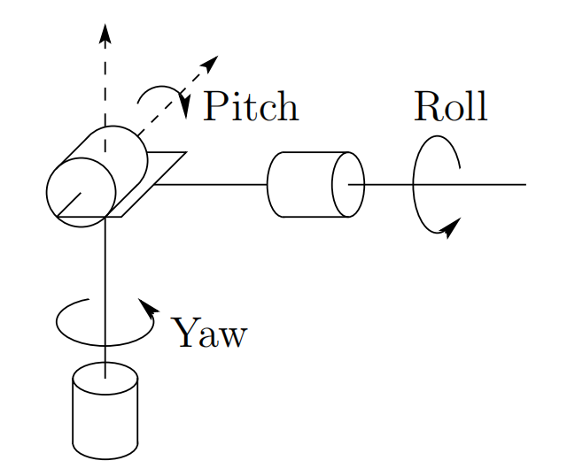
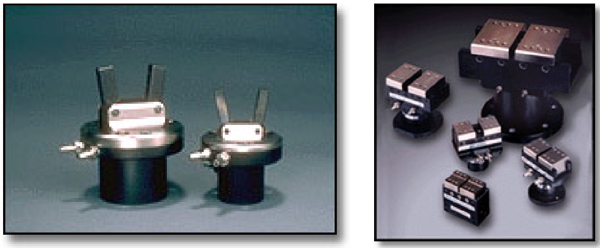

&emsp;
# Wrists and End-Effectors

The wrist of a manipulator refers to the joints in the kinematic chain between the arm and hand. The wrist joints are nearly always all revolute. It is increasingly common to design manipulators with spherical wrists, by which we mean wrists whose three joint axes intersect at a common point. The spherical wrist is represented symbolically in Figure 1.22.

    
    <h4>Figure 1.21: Linear vs. rotational link motion<h>

&emsp;

The spherical wrist greatly simplifies the kinematic analysis, effectively allowing one to decouple the positioning and orientation of an object to as great an extent as possible.

Typically therefore, the manipulator will possess three positional degrees-of-freedom, which are produced by three or more joints in the arm. The number of orientational degrees-of-freedom will then depend on the degrees-of-freedom of the wrist. It is common to find wrists
having one, two, or three degrees-of-freedom depending of the application. 

For example, the SCARA robot shown in Figure 1.11 has four degrees-of-freedom: 
- three for the arm
- one for the wrist, which has only a roll about the final z-axis.

It has been said that a robot is only as good as its hand or end-effector. The arm and wrist assemblies of a robot are used primarily for positioning the end-effector and any tool it may carry. It is the end-effector or tool that actually performs the work. 

The simplest type of end-effectors are grippers, such as shown in Figure 1.23 which usually are capable of only two actions, opening and closing. 

    
    <h4>Figure 1.23: Angular Jaw and Parallel Jaw Grippers<h>

&emsp;

While this is adequate for materials transfer, some parts handling, or gripping simple tools, it is not adequate for other tasks such as welding, assembly, grinding, etc. A great deal of research is therefore being devoted to the design of special purpose end-effectors as well as tools that can be rapidly changed as the task dictates.

There is also much research being devoted to the development of anthropomorphic hands. Such hands are being developed both for prosthetic use and for use in manufacturing. Since we are concerned with the analysis and control of the manipulator itself and not in the particular application or end-effector, we will not discuss end-effector design or the study of grasping and manipulation.