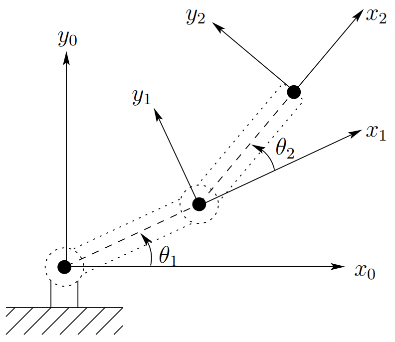

&emsp;
# Forward Kinematics

The first problem encountered is to describe both the `position` of the tool and the `locations` $A$ and $B$ (and most likely the entire surface $S$) with respect to a common coordinate system. In Chapter 2 we give some background on representations of coordinate systems and transformations among various coordinate systems.

Typically, the manipulator will be able to sense its own position in some manner using internal sensors (position encoders) located at joints $1$ and $2$, which can measure directly the joint angles $θ_1$ and $θ_2$. We also need therefore to express the positions A and B in terms of these joint angles. This leads to the forward kinematics problem studied in Chapter 3, which is to determine the position and orientation of the end-effector or tool in terms of the joint variables.

It is customary to establish a fixed coordinate system, called the world or base frame to which all objects including the manipulator are referenced. In this case we establish the base coordinate frame $o_0x_0y_0$ at the base of the robot, as shown in Figure 1.25. 

    
    <h4>Figure 1.25: Coordinate frames for two-link planar robot<h>

&emsp;

The coordinates $(x, y)$ of the tool are expressed in this coordinate frame as:

$$x=x_2 = α_1cosθ_1 + α_2cos(θ_1 + θ_2) $$
$$y=y_2 = α_1sinθ_1 + α_2sin(θ_1 + θ_2) $$

in which $α_1$ and $α_2$ are the lengths of the two links, respectively. Also the orientation of the tool frame relative to the base frame is given by the direction cosines of the $x_2$ and $y_2$ axes relative to the $x_0$ and $y_0$ axes, that is,

$$x_2\cdot x_0 = cos(θ_1 + θ_2);\quad x_2\cdot y_0 = cos(θ_1 + θ_2); $$
$$y_2\cdot x_0 = sin(θ_1 + θ_2);\quad y_2\cdot y_0 = sin(θ_1 + θ_2); $$

which we may combine into an orientation matrix

$$\begin{bmatrix}x_2\cdot x_0 & y_2\cdot x_0  \\
x_2\cdot y_0 & y_2\cdot y_0\end{bmatrix} = \begin{bmatrix}
cos(θ_1 + θ_2) & -sin(θ_1 + θ_2) \\
sin(θ_1 + θ_2) & cos(θ_1 + θ_2)
\end{bmatrix}$$

These equations (1.1-1.4) are called the forward kinematic equations. For a six degree-of-freedom robot these equations are quite complex and cannot be written down as easily as for the two-link manipulator. The general procedure that we discuss in Chapter 3 establishes coordinate frames at each joint and allows one to transform systematically among these frames using matrix transformations. The procedure that we use is referred to as the Denavit-Hartenberg convention. We then use homogeneous coordinates and homogeneous transformations to simplify the transformation among coordinate frames.
