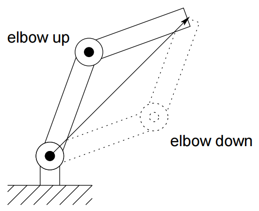
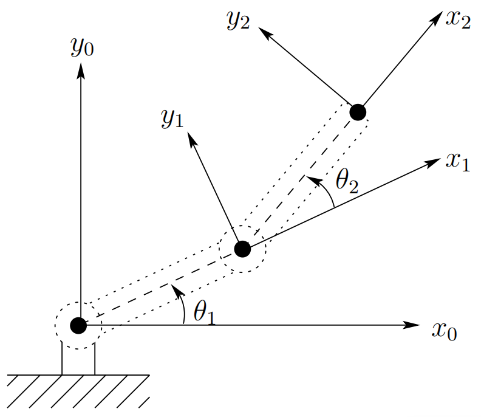
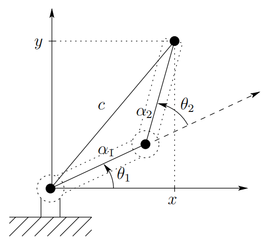

&emsp;
# Inverse Kinematics

Now, given the joint angles $θ_1$, $θ_2$ we can determine the end-effector coordinates x and y.

In order to command the robot to move to location B we need the inverse; that is, we need the joint variables θ1, θ2 in terms of the x and y coordinates of B. This is the problem of `Inverse Kinematics`. In other words, given x and y in the forward kinematic equations $(1.1-1.2)$, we wish to solve for the joint angles. Since the forward kinematic equations are nonlinear, a solution may not be easy to find nor is there a unique solution in general. 

We can see, for example, in the case of a two-link planar mechanism that there may be no solution, if the given $(x, y)$ coordinates are out of reach of the manipulator. If the given $(x, y)$ coordinates are within the manipulator’s reach there may be two solutions as shown in Figure 1.26, the so-called elbow up and elbow down configurations, or there may be exactly one solution if the manipulator must be fully extended to reach the point. 

    
    <h4>Figure 1.26: Multiple inverse kinematic solutions<h>

&emsp;

There may even be an infinite number of solutions in some cases (Problem 1.25).

    
    <h4>Figure 1.25: Coordinate frames for two-link planar robot<h>

&emsp;

    
    <h4>Figure 1.27: Solving for the joint angles of a two-link planar arm<h>

&emsp;

Consider the diagram of Figure 1.27. Using the Law of Cosines we see that the angle $θ_2$ is given by

$$cosθ_2 = \frac{x^2 + y^2-α_1^2 - α_2^2}{2α_1α_2} = D \tag{1.5}$$

We could now determine $θ_2$ as

$$θ_2 = cos^{-1}(D) \tag{1.6}$$

However, a better way to find $θ_2$ is to notice that if $cos(θ_2)$ is given by $(1.5)$ then $sin(θ_2)$ is given as

$$sin(θ_2) = \pm\sqrt{1-D^2} \tag{1.7}$$

and, hence, $θ_2$ can be found by

$$θ_2 = tan^{-1} \frac{\pm\sqrt{1-D^2}}{D}$$

The advantage of this latter approach is that both the elbow-up and elbow-down solutions are recovered by choosing the positive and negative signs in $(1.8)$, respectively.

It is left as an exercise (Problem $1.19$) to show that $θ_1$ is now given as

$$θ_1 = tan^{-1}(y/x) - tan^{-1}\Big(\frac{α_2 sinθ_2}{α_1 + α_2 cosθ_2}\Big)$$

Notice that the angle $θ_1$, depends on $θ_2$. This makes sense physically since we would expect to require a different value for $θ_1$, depending on which solution is chosen for $θ_2$.