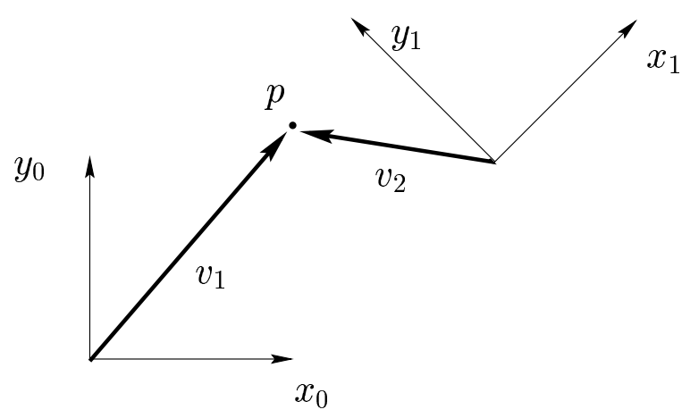

&emsp;
# Representing Positions

Before developing representation schemes for points and vectors, it is instructive to distinguish between the two fundamental approaches to geometric reasoning: 
- the synthetic approach
- the analytic approach

In the former, one reasons directly about geometric entities (e.g., points or lines), while in the latter, one represents these entities using coordinates or equations, and reasoning is performed via algebraic manipulations.

&emsp;
## 1 Synthetic Approach

    
    <h4>Figure 2.1: Two coordinate frames, a point p, and two vectors v1 and v2<h>

&emsp;

Consider Figure 2.1. Using the synthetic approach, without ever assigning coordinates to points or vectors, one can say that $x_0$ is perpendicular to $y_0$, or that $\vec{v}_1 × \vec{v}_2$ defines a vector that is perpendicular to the plane containing $\vec{v}_1$ and $\vec{v}_2$, in this case pointing out of the page.

&emsp;
## 2 Analytic Approach
In robotics, one typically uses analytic reasoning, since robot tasks are often defined in a Cartesian workspace, using Cartesian coordinates. 

Of course, in order to assign coordinates it is necessary to specify a coordinate frame. Consider again Figure 2.1. We could specify the coordinates of the point $p$ with respect to either frame $o_0-x_0-y_0$ or frame $o_1-x_1-y_1$. 

In the former case, we might assign to $p$ the coordinate vector $(5, 6)^T$, and in the latter case $(−3, 4)^T$. So that the reference frame will always be clear, we will adopt a notation in which a superscript is used to denote the reference frame. Thus, we would write

$$p^0 = [5, 6]^T，p^1 = [-3, 4]^T \tag{2.1}$$

Geometrically, a point corresponds to a specific location in space. We stress here that $p \neq p_0$ and $p \neq p_1$, $i.e.$, $p$ is a geometric entity, a point in space, while both $p_0$ and $p_1$ are coordinate vectors that represent the location of this point in space with respect to coordinate frames $o_0-x_0-y_0$ and $o_1-x_1-y_1$, respectively.

&emsp;
## Relation between coordinate system
### Point

Since the origin of a coordinate system is just a point in space, we can assign coordinates that represent the position of the origin of one coordinate system with respect to another. In Figure 2.1, for example,

$$o^0_1 = [10, 5]^T，o^1_0=[-10, 5] \tag{2.2}$$

In cases where there is only a single coordinate frame, or in which the reference frame is obvious, we will often omit the superscript. This is a slight abuse of notation, and the reader is advised to bear in mind the difference between the geometric entity called $p$ and any particular coordinate vector that is assigned to represent $p$. 

The former is invariant with respect to the choice of coordinate systems, while the latter obviously depends on the choice of coordinate frames.

&emsp;
### Vector

While a point corresponds to a specific location in space, a vector specifies a direction and a magnitude. Vectors can be used, for example, to represent displacements or forces.

Therefore, while the point $p$ is not equivalent to the vector $\vec{v}_1$, the displacement from the origin $o_0$ to the point $p$ is given by the vector $\vec{v}_1$. 

In this text, we will use the term vector to refer to what are sometimes called free vectors, i.e., vectors that are not constrained to be located at a particular point in space. 

&emsp;
### 

Under this convention, it is clear that points and vectors are not equivalent, since points refer to specific locations in space, but a vector can be moved to any location in space. Under this convention, two vectors are equal if they have the same direction and the same magnitude.

When assigning coordinates to vectors, we use the same notational convention that we used when assigning coordinates to points. Thus, $v_1$ and $v_2$ are geometric entities that are invariant with respect to the choice of coordinate systems, but the representation by coordinates of these vectors depends directly on the choice of reference coordinate frame.

In the example of Figure 2.1, we would obtain

$$v^0_1 = [5, 6]^T，v^1_1 = [8, 1]^T，v^0_2 = [-5, 1]^T，v^1_2 = [-3, 4]^T \tag{2.3}$$

In order to perform algebraic manipulations using coordinates, it is essential that all coordinate vectors be defined with respect to the same coordinate frame. For example, an expression of the form $v^1_1 + v^2_2$ would make no sense geometrically. 

Thus, we see a clear need, not only for a representation system that allows points to be expressed with respect to various coordinate systems, but also for a mechanism that allows us to transform the coordinates of points that are expressed in one coordinate system into the appropriate coordinates with respect to some other coordinate frame. Such coordinate transformations and their derivations are the topic for much of the remainder of this chapter.