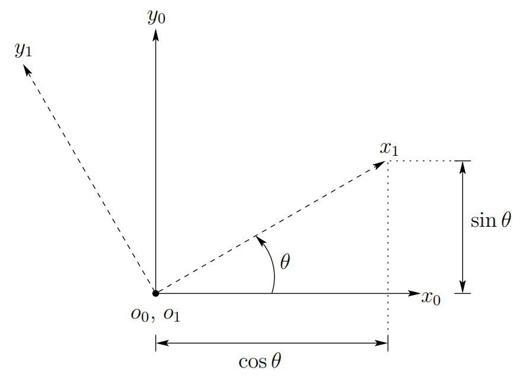

&emsp;
# Rotation in the plane

    
    <h4>Figure 2.2: Coordinate frame o1x1y1 is oriented at an angle θ with respect to o0x0y0<h>

&emsp;

Figure 2.2 shows two coordinate frames, with frame $o_1-x_1-y_1$ being obtained by rotating frame $o_0-x_0-y_0$ by an angle $θ$. Perhaps the most obvious way to represent the relative orientation of these two frames is to merely specify the angle of rotation, $θ$. 

There are two immediate disadvantages to such a representation:
- First, there is a discontinuity in the mapping from relative orientation to the value of $θ$ in a neighborhood of $θ = 0$. In particular, for $θ = 2π−\epsilon$ , small changes in orientation can produce large changes in the value of $θ$ (i.e., a rotation by $\epsilon$ causes $θ$ to “wrap around” to zero). 

- Second, this choice of representation does not scale well to the three dimensional case, with which we shall be primarily concerned in this text.

A slightly less obvious way to specify the orientation is to specify the coordinate vectors for the axes of frame $o_1-x_1-y_1$ with respect to coordinate frame $o_0-x_0-y_0$. In particular, we can build a matrix of the form:

$$R^0_1 = [x^0_1 | y^0_1]\tag{2.4}$$

A matrix in this form is called a rotation matrix. Rotation matrices have a number of special properties, which we will discuss below.

In the two dimensional case, it is straightforward to compute the entries of this matrix. As illustrated in Figure 2.2,

$$x^0_1 = \begin{bmatrix}cosθ \\ sin θ\end{bmatrix}，
y^0_1 = \begin{bmatrix}-sinθ \\ cos θ\end{bmatrix} \tag{2.5}$$

which gives

$$R^0_1 = \begin{bmatrix}cosθ & -sinθ \\ 
sinθ & cosθ\end{bmatrix}\tag{2.6}$$

Note that we have continued to use the notational convention of allowing the superscript to denote the reference frame. Thus, $R^0_1$ is a matrix whose column vectors are the coordinates of the axes of frame $o_1x_1y_1$ expressed relative to frame $o_0x_0y_0$.

Although we have derived the entries for $R^0_1$ in terms of the angle $θ$, it is not necessary that we do so. An alternative approach, and one that scales nicely to the three dimensional case, is to build the rotation matrix by projecting the axes of frame o1x1y1 onto the coordinate axes of frame $o_0x_0y_0$. Recalling that the dot product of two unit vectors gives the projection of one onto the other, we obtain

$$x^0_1 = \begin{bmatrix}x_1 \cdot x_0 \\x_1 \cdot y_0 \end{bmatrix}，
y^0_1 = \begin{bmatrix}y_1 \cdot x_0\\ y_1 \cdot y_0\end{bmatrix}\tag{2.7}$$

which can be combined to obtain the rotation matrix

$$R^0_1 = \begin{bmatrix}x_1\cdot x_0 & y_1\cdot x_0 \\
x_1\cdot y_0 & y_1\cdot y_0  \end{bmatrix} \tag{2.8}$$

Thus the columns of $R^0_1$ specify the direction cosines of the coordinate axes of $o_1-x_1-y_1$ relative to the coordinate axes of $o_0-x_0-y_0$. For example, the first column $(x_1·x_0, x_1·y_0)^T$ of $R^0_1$ specifies the direction of $x_1$ relative to the frame $o_0x_0y_0$. Note that the right hand sides of these equations are defined in terms of geometric entities, and not in terms of their coordinates.

Examining Figure 2.2 it can be seen that this method of defining the rotation matrix by projection gives the same result as was obtained in equation (2.6).

If we desired instead to describe the orientation of frame o0x0y0 with respect to the frame $o_1x_1y_1$ (i.e., if we desired to use the frame $o_1x_1y_1$ as the reference frame), we would construct a rotation matrix of the form

$$R^1_0 = \begin{bmatrix}x_0\cdot x_1 & y_0 \cdot x_1 \\
x_0\cdot y_1 & y_0 \cdot y_1 \end{bmatrix} \tag{2.9}$$

Since the inner product is commutative, $(i.e. x_i·y_j = y_j·x_i)$, we see that

$$R^1_0 = (R^0_1)^T \tag{2.10}$$

In a geometric sense, the orientation of $o_0-x_0-y_0$ with respect to the frame $o_1-x_1-y_1$ is the inverse of the orientation of $o_1-x_1-y_1$ with respect to the frame $o_0-x_0-y_0$. Algebraically, using the fact that coordinate axes are always mutually orthogonal, it can readily be seen that

$$(R^0_1)^T = (R^0_1)^{-1} \tag{2.11}$$

Such a matrix is said to be orthogonal. The column vectors of $R^0_1$ are of unit length and mutually orthogonal (Problem 2-1). It can also be shown (Problem 2-2) that det $R^0_1 = ±1$.
If we restrict ourselves to right-handed coordinate systems, as defined in Appendix A, then det $R^0_1 = \pm1$ (Problem 2-3). All rotation matrices have the properties of being orthogonal
matrices with determinant +1. It is customary to refer to the set of all 2 × 2 rotation matrices by the symbol $SO(2)$. The properties of such matrices are summarized in Figure 2.3.

    
    <h4>Figure 2.3: Properties of Rotation Matrices<h>

&emsp;

To provide further geometric intuition for the notion of the inverse of a rotation matrix, note that in the two dimensional case, the inverse of the rotation matrix corresponding to a rotation by angle $θ$ can also be easily computed simply by constructing the rotation matrix for a rotation by the angle $−θ$: