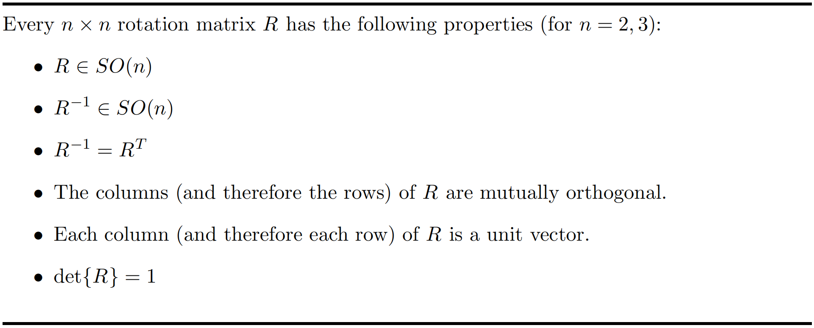
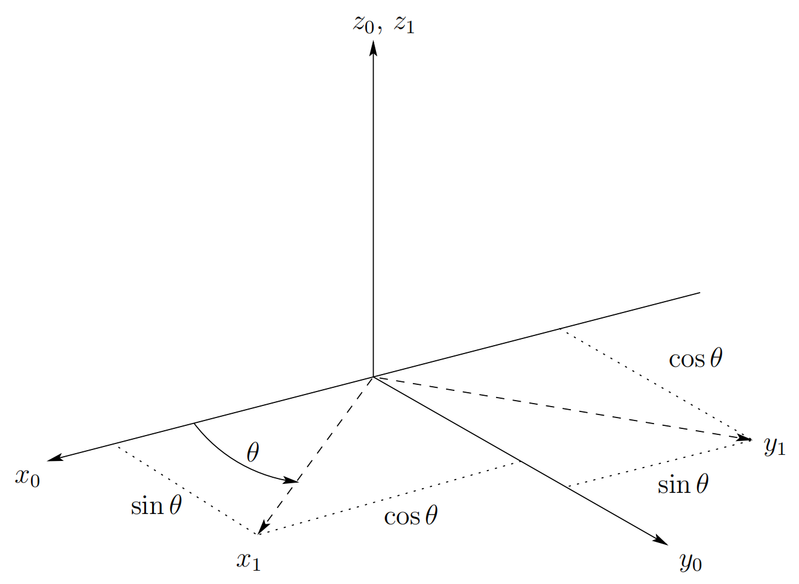

&emsp;
# Rotations in three dimensions

The projection technique described above scales nicely to the three dimensional case.
In three dimensions, each axis of the frame $o_1-x_1-y_1-z_1$ is projected onto coordinate frame $o_0-x_0-y_0-z_0$. The resulting rotation matrix is given by

$$R^0_1 = \begin{bmatrix}x_1 \cdot x_0 & y_1 \cdot x_0 &z_1 \cdot x_0 \\
x_1 \cdot y_1 & y_1 \cdot y_0 & z_1 \cdot y_0 \\
x_1 \cdot z_1 & y_1 \cdot z_0 & z_1 \cdot z_0 
\end{bmatrix}$$

As was the case for rotation matrices in two dimensions, matrices in this form are orthogonal, with determinant equal to $1$. In this case, $3 × 3$ rotation matrices belong to the group $SO(3)$. The properties listed in Figure 2.3 also apply to rotation matrices in $SO(3)$.

    
    <h4>Figure 2.3: Properties of Rotation Matrices<h>

&emsp;

Example 2.1 Suppose the frame $o_1x_1y_1z_1$ is rotated through an angle $θ$ about the $z_0-axis$, and it is desired to find the resulting transformation matrix $R^0_1$. Note that by convention the positive sense for the angle $θ$ is given by the right hand rule; that is, a positive rotation of $θ$ degrees about the $z-axis$ would advance a right-hand threaded screw along the positive $z-axis$. 

From Figure 2.4 we see that

    
    <h4>Figure 2.4: Rotation about z0<h>

&emsp;

and all other dot products are zero. Thus the transformation $R^0_1$ has a particularly simple form in this case, namely

$$R^0_1 = \begin{bmatrix}cosθ & -sinθ & 0\\
sinθ & cosθ & 0 \\ 0 & 0 & 1
\end{bmatrix}$$