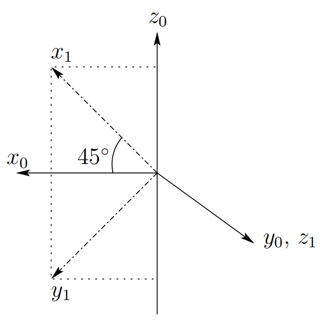

&emsp;
# Rotations in three dimensions

The projection technique described above scales nicely to the three dimensional case.
In three dimensions, each axis of the frame $o_1-x_1-y_1-z_1$ is projected onto coordinate frame $o_0-x_0-y_0-z_0$. The resulting rotation matrix is given by

$$R^0_1 = \begin{bmatrix}x_1 \cdot x_0 & y_1 \cdot x_0 &z_1 \cdot x_0 \\
x_1 \cdot y_1 & y_1 \cdot y_0 & z_1 \cdot y_0 \\
x_1 \cdot z_1 & y_1 \cdot z_0 & z_1 \cdot z_0 
\end{bmatrix}$$

As was the case for rotation matrices in two dimensions, matrices in this form are orthogonal, with determinant equal to $1$. In this case, $3 × 3$ rotation matrices belong to the group $SO(3)$. The properties listed in Figure 2.3 also apply to rotation matrices in $SO(3)$.

    
    <h4>Figure 2.3: Properties of Rotation Matrices<h>

&emsp;

Example 2.1 Suppose the frame $o_1x_1y_1z_1$ is rotated through an angle $θ$ about the $z_0-axis$, and it is desired to find the resulting transformation matrix $R^0_1$. Note that by convention the positive sense for the angle $θ$ is given by the right hand rule; that is, a positive rotation of $θ$ degrees about the $z-axis$ would advance a right-hand threaded screw along the positive $z-axis$. 

From Figure 2.4 we see that

$$x_1 \cdot x_0 = cosθ，y_1 \cdot x_0 = -sinθ $$
$$x_1 \cdot y_0 = sinθ，y_1 \cdot y_0 = cosθ $$

    
    <h4>Figure 2.4: Rotation about z0<h>

&emsp;

and all other dot products are zero. Thus the transformation $R^0_1$ has a particularly simple form in this case, namely

$$R^0_1 = \begin{bmatrix}cosθ & -sinθ & 0\\
sinθ & cosθ & 0 \\ 0 & 0 & 1
\end{bmatrix} \tag{2.15}$$

&emsp;
## The Basic Rotation Matrices

The transformation (2.15) is called a basic rotation matrix (about the z-axis). In this case we find it useful to use the more descriptive notation $R_{z,θ}$, instead of $R^0_1$
to denote the matrix (2.15). It is easy to verify that the basic rotation matrix $R_{z,θ}$ has the properties

$$R_{z, 0} = I \tag{2.16}$$
$$R_{z, θ}R_{z, \phi} = R_{z, θ+\phi} \tag{2.17}$$

which together imply

$$R_{z, θ}^{-1} = R_{z, -θ} \tag{2.18}$$

Similarly the basic rotation matrices representing rotations about the $x$ and $y-axes$ are given as (Problem 2-5)

$$R_{x, θ} = \begin{bmatrix}1 & 0 & 0 \\
0 & cos θ & -sinθ \\ 0 & sin θ & cosθ\end{bmatrix} \tag{2.19}$$

$$R_{y, θ} = \begin{bmatrix}cos θ & 0 & sin θ \\
0 & 1 & 0 \\ -sin θ & 0 & cosθ\end{bmatrix} \tag{2.20}$$

which also satisfy properties analogous to (2.16)-(2.18).

## Example 2.2 

    
    <h4>Figure 2.5: Defining the relative orientation of two frames<h>

&emsp;

Consider the frames $o_0-x_0-y_0-z_0$ and $o_1-x_1-y_1-z_1$ shown in Figure 2.5. Projecting the unit vectors $x_1, y_1, z_1$ onto $x_0, y_0, z_0$ gives the coordinates of $x_1, y_1, z_1$ in the $o_0-x_0-y_0-z_0$ frame. We see that the coordinates of x1 are  √12 , 0, √12 T, the coordinates of y1 are  √12 , 0, −1 √2 T and the coordinates of $z_1$ are $(0, 1, 0)^T$. The rotation matrix R01 specifying the orientation of $o_1-x_1-y_1-z_1$ relative to o0x0y0z0 has these as its column vectors, that is,

$$R^0_1 = \begin{bmatrix}
\frac{1}{\sqrt{2}} & \frac{1}{\sqrt{2}}  & 0 \\
0 & 0 & 1 \\ \frac{1}{\sqrt{2}}  & -\frac{1}{\sqrt{2}}  & 0\end{bmatrix} \tag{2.21}$$

