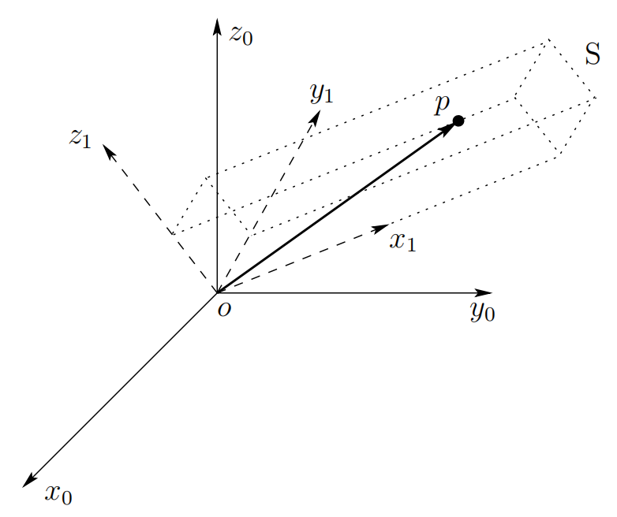
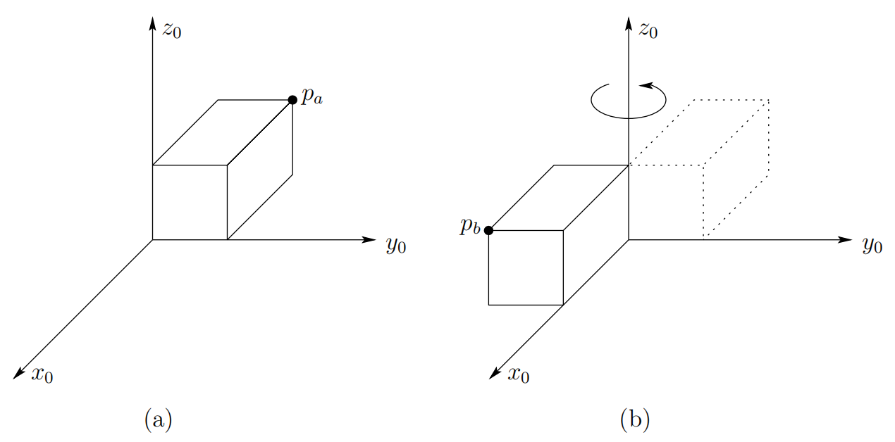
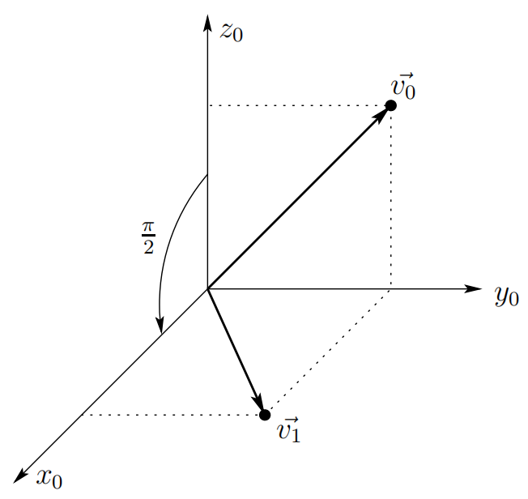

&emsp;
# Rotational Transformations

    
    <h4>Figure 2.6: Coordinate frame attached to a rigid body<h>

&emsp;

Figure 2.6 shows a rigid object $S$ to which a coordinate frame $o_1-x_1-y_1-z_1$ is attached. Given the coordinates $p1$ of the point $p$ (i.e., given the coordinates of p with respect to the frame o1x1y1z1), we wish to determine the coordinates of $p$ relative to a fixed reference frame $o_0-x_0-y_0-z_0$.

The coordinates $p^1 = (u, v, w)^t$ satisfy the equation

$$p = ux_1 + vy_1 +wz_1 \tag{2.22}$$

In a similar way, we can obtain an expression for the coordinates $p_0$ by projecting the point $p$ onto the coordinate axes of the frame $o_0-x_0-y_0-z_0$, giving

$$p^0 = \begin{bmatrix}p\cdot x_0 \\ p\cdot y_0 \\ p\cdot z_0\end{bmatrix} \tag{2.23}$$

Combining these two equations we obtain

$$p^0 = \begin{bmatrix}(ux_1 + vy_1 + wz_1)\cdot x_0 \\
(ux_1 + vy_1 + wz_1)\cdot y_0 \\
(ux_1 + vy_1 + wz_1)\cdot z_0
\end{bmatrix} \tag{2.24} $$

$$\qquad\quad\ \ \ = \begin{bmatrix}ux_1 \cdot x_0 + vy_1\cdot x_0 + wz_1 \cdot x_0 \\
ux_1 \cdot y_0 + vy_1\cdot y_0 + wz_1 \cdot y_0 \\
ux_1 \cdot z_0 + vy_1\cdot z_0 + wz_1 \cdot z_0 
\end{bmatrix}\tag{2.25}$$

$$\qquad\quad\ \ \ = \begin{bmatrix}x_1 \cdot x_0 & y_1\cdot x_0 & z_1\cdot x_0 \\ 
x_1 \cdot y_0 & y_1\cdot y_0 & z_1\cdot y_0 \\ 
x_1 \cdot z_0 & y_1\cdot z_0 & z_1\cdot z_0 
\end{bmatrix}\begin{bmatrix}u \\ v \\ w\end{bmatrix} \tag{2.26}$$

But the matrix in this final equation is merely the rotation matrix $R^0_1$, which leads to

$$p^0 = R^0_1p^1\tag{2.27}$$

Thus, the rotation matrix $R^0_1$ can be used not only to represent the orientation of coordinate frame $o_1-x_1-y_1-z_1$ with respect to frame $o_0-x_0-y_0-z_0$, but also to transform the coordinates of a point from one frame to another. Thus, if a given point is expressed relative to $o_1x_1y_1z_1$ by coordinates $p_1$, then $R^0_1p_1$ represents the same point expressed relative to the frame $o_0x_0y_0z_0$.

We have now seen how rotation matrices can be used to relate the orientation of one frame to another frame, and to assign coordinate representations to points and vectors. For example, given a point $p$ in space, we have shown how a rotation matrix can be used to derive coordinates for p with respect to different coordinate frames whose orientations are related by a rotation matrix. We can also use rotation matrices to represent rigid motions that correspond to pure rotation. 

    
    <h4>Figure 2.7: The block in (b) is obtained by rotating the block in (a) by π about z0<h>

&emsp;

Consider Figure 2.7. One corner of the block in Figure 2.7(a) is located at the point pa in space. Figure 2.7(b) shows the same block after it has been rotated about $z_0$ by the angle $π$. In Figure 2.7(b), the same corner of the block is now located at point $p^b$ in space. It is possible to derive the coordinates for pb given only the coordinates for pa and the rotation matrix that corresponds to the rotation about $z_0$.

To see how this can be accomplished, imagine that a coordinate frame is rigidly attached to the block in Figure 2.7(a), such that it is coincident with the frame $o_0x_0y_0z_0$. After the rotation by $π$, the block’s coordinate frame, which is rigidly attached to the block, is also rotated by $π$. If we denote this rotated frame by $o_1-x_1-y_1-z_1$, we obtain

$$R^0_1 = R_{z, \pi} = \begin{bmatrix}-1 & 0 & 0 \\
0 & -1 & 0 \\ 0 & 0 & 1\end{bmatrix} \tag{2.28}$$

In the local coordinate frame $o_1-x_1-y_1-z_1$, the point pb has the coordinate representation $p^1_b$.
To obtain its coordinates with respect to frame o0x0y0z0, we merely apply the coordinate transformation equation (2.27), giving

$$p^0_b = R_{z, \pi}p^1_b \tag{2.29}$$

The key thing to notice is that the local coordinates, $p^1_b$, of the corner of the block do not change as the block rotates, since they are defined in terms of the block’s own coordinate frame. Therefore, when the block’s frame is aligned with the reference frame $o_0-x_0-y_0-z_0$ (i.e., before the rotation is performed), the coordinates $p^1_b = p^0_a$, since before the rotation is performed, the point pa is coincident with the corner of the block. Therefore, we can substitute $p^0_a$ into the previous equation to obtain

$$p^0_b = R_{z, \pi}p^0_a \tag{2.30}$$

This equation shows us how to use a rotation matrix to represent a rotational motion. In particular, if the point $p_b$ is obtained by rotating the point $p_a$ as defined by the rotation matrix $R$, then the coordinates of $p_b$ with respect to the reference frame are given by

$$p^0_b = Rp^0_a \tag{2.31}$$

This same approach can be used to rotate vectors with respect to a coordinate frame, as the following example illustrates.

## Example 2.3 

    
    <h4>Figure 2.7: The block in (b) is obtained by rotating the block in (a) by π about z0<h>

&emsp;

The vector $\vec{v}$ with coordinates $v^0 = (0, 1, 1)^T$
is rotated about $y_0$ by $\frac{π}{2}$ as shown in Figure 2.8. The resulting vector $v1$ has coordinates given by

$$v^0_1 = R_{y, \frac{\pi}{2}}v^0 \tag{2.32}$$

$$= \begin{bmatrix}0&0&1 \\ 0&1&0 \\ -1&0&0\end{bmatrix}\begin{bmatrix} 0 \\ 1 \\ 1\end{bmatrix} = \begin{bmatrix}1 \\ 1 \\ 0\end{bmatrix} \tag{2.33}$$

Thus, as we have now seen, a third interpretation of a rotation matrix $R$ is as an operator acting on vectors in a fixed frame. In other words, instead of relating the coordinates of a fixed vector with respect to two different coordinate frames, the expression (2.32) can represent the coordinates in $o_0x_0y_0z_0$ of a vector $\vec{v}_1$ which is obtained from a vector $\vec{v}$ by a given rotation

## Summary

We have seen that a rotation matrix, either $R ∈ SO(3)$ or $R ∈ SO(2)$, can be interpreted in three distinct ways:
1. It represents a coordinate transformation relating the coordinates of a point $p$ in two different frames.
2. It gives the orientation of a transformed coordinate frame with respect to a fixed coordinate frame.
3. It is an operator taking a vector and rotating it to a new vector in the same coordinate system.

The particular interpretation of a given rotation matrix R that is being used must then bemade clear by the context.