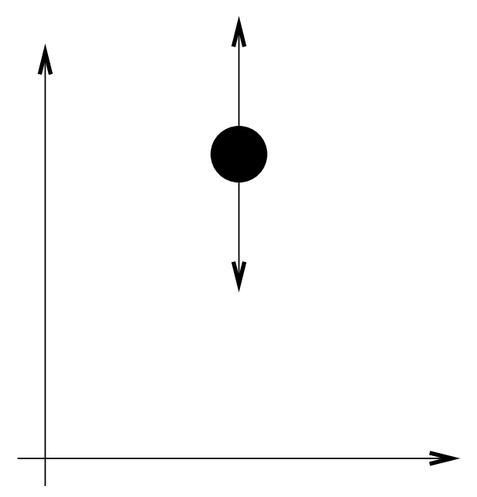

&emsp;
#  One Dimensional System

To motivate the subsequent derivation, we show first how the Euler-Lagrange equations can be derived from `Newton’s Second Law` for a single degree of freedom system consisting of a particle of constant mass $m$, constrained to move in the $y$-direction, and subject to a force $f$ and the gravitational force $mg$, as shown in Figure 9.1. By Newton’s Second law, $F = ma$, 

    
    <h4>Figure 9.1: One Degree of Freedom System</h>

&emsp;
## 1 Equation of Motion
the equation of motion of the particle is
$$m\ddot{y} = f - mg \tag{9.1}$$

Notice that the left hand side of Equation (9.1) can be written as

$$ m\ddot{y} = \frac{d}{dt}(m\dot{y}) = \frac{d}{dt}\frac{\partial}{\partial \dot{y}} \Big(\frac{1}{2}m\dot{y}^2 \Big) = \frac{d}{dt}\frac{\partial \mathcal{K}}{\partial \dot{y}} \tag{9.2}$$

- $\mathcal{K} = \frac{1}{2}m\dot{y}^2 $: is the kinetic energy. 

We use the partial derivative notation in the above expression to be consistent with systems considered later when the kinetic energy will be a function of several variables. 

&emsp;
## 2 Gravitational Force
Likewise we can express the gravitational force in Equation (9.1) as

$$mg = \frac{\partial}{\partial y}(mgy) = \frac{\partial \mathcal{P}}{\partial y} \tag{9.3}$$
- $\mathcal{P} = mgy$: potential energy due to gravity

&emsp;
## 3 Euler-Lagrange Equation
If we define 
$$\mathcal{L} = \mathcal{K} - \mathcal{P} = \frac{1}{2}m\dot{y}^2 - mgy \tag{9.4}$$

and note that

$$\frac{\partial \mathcal{L}}{\partial \dot{y}} = \frac{\partial \mathcal{K}}{\partial \dot{y}}，and\quad
\frac{\partial \mathcal{L}}{\partial y} = -\frac{\partial \mathcal{P}}{\partial y}$$

then we can write Equation (9.1) as

$$\frac{d}{dt}\frac{\partial \mathcal{L}}{\partial \dot{y}} - \frac{\partial \mathcal{L}}{\partial y} = f \tag{9.5}$$

The function $\mathcal{L}$, which is the difference of the kinetic and potential energy, is called the Lagrangian of the system, and Equation (9.5) is called the `Euler-Lagrange Equation`.

The Euler-Lagrange equations provide a formulation of the dynamic equations of motion equivalent to those derived using Newton’s Second Law. However, as we shall see, the Lagrangian approach is advantageous for more complex systems such as multi-link robots.